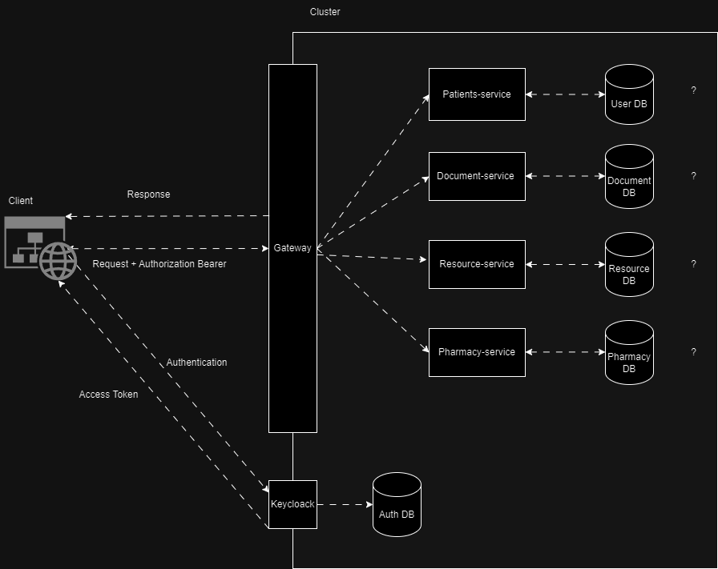

# Hospital Management System (HMS)

This project is a proof of concept for a Hospital Management System (HMS) using Keycloak for authentication and authorization, KrakenD as an API gateway, and Kubernetes for deployment and management.
 
The HMS aims to provide a comprehensive solution for managing various aspects of a hospital, including patient records, appointments, medical staff, and more. Keycloak is used for secure user authentication and authorization, ensuring that only authorized personnel can access sensitive information.

# System Architecture:

1. **Keycloak**: Keycloak is an open-source identity and access management solution, used for authentication and authorization.

2. **KrakenD**: KrakenD is an API gateway that sits between clients and backend services, providing a unified interface for accessing multiple services.

3. **Example Client App**: The client app is a frontend application built using JavaScript, which interacts with the backend services through the KrakenD API gateway. Currenly used as a testing client for the system concepts.

# TODO

5. **Kubernetes**: Kubernetes as a container orchestration platform is used to deploy and manage the services.

## Target Architecture:

# Development Environment:
## To develop and test the project, you will need the following tools:
1. Local Kubernetes cluster (For now we are using Minikube) -> `minikube.sigs.k8s.io`
2. Tilt -> `tilt.dev`
## Starting Development Environment
- If you are using Windows, refer to the `WindowsSetup.md` file for setup instructions.
- If you are using Linux, run the `LinuxSetup.sh` script.

After successfully setting up minikube just run `tilt up` in the root directory of the project. This will start the development environment and open the browser with tilt UI.
## Creating HMS realm in Keycloak
- Open the Keycloak admin console at `auth.hms.test`
- Login with the admin credentials (username: `admin`, password: `admin`)
- Create a new realm by importing the `hms-realm.json` file from the `keycloak` directory

## Accessing the Example Client App
- Open the browser and navigate to `hms.test`
